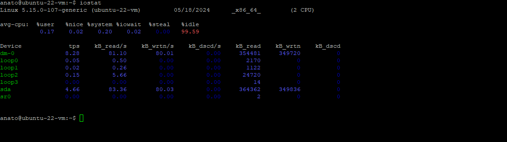

## Проверка сетегово подключения.

Отправка 4 пакетов для проверки сооедения


## Проверка доступа к веб-серверу по протоколу HTTP/HTTPS.


## Проверка работы основных служб.

> **Так же можно использовать ```service --status-all | grep '\[ + \]'``` для получения полного списка запушеных служб**

### SSH


---
### FTP


---
### NFS


---

## Проверка логов сервера на наличе ошибок.
Проверка логов на наличия ошибок через grep.


## Базовая проверка производительности системы.


Просмотор использования ресурсов и процесов чрез top.


---

htop усовершенствованный аналог top.


---

Проверка статистики ввода и вывода данных хранилища операционной системы.




---
Просмотр статистики виртуальной памяти.


---
Проверка прозводительности CPU.


---

Проверка скорости работы функций памяти.


